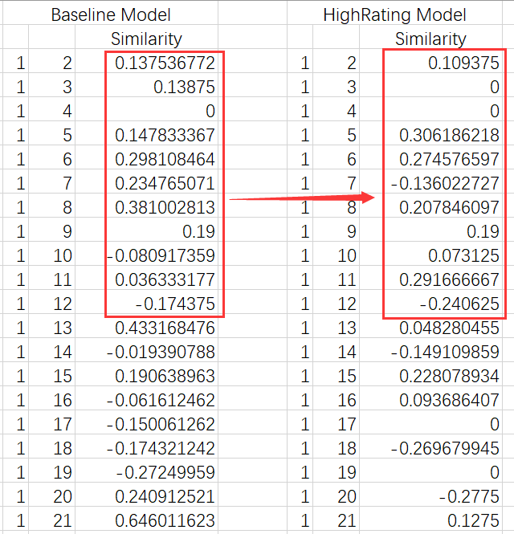

在这之前所做的推荐系统的工作中，我们考虑并且比较了最相似用户数量`TOPN`和推荐的电影数`AMOUNT`两个变量对推荐系统结果的影响，具体可以查看前文的结果分析，在最后，同样也做了一些其他的考虑，由于诸多因素，还未能仔细验证。本次改进是针对授课老师所提出的几点想法进行的，主要在两个方面：（1）看与不看本身是否能影响评分相似度。也就是说，如果我们只是考虑用户看或者不看这部电影，不考虑评分，在这种情况下，用户之间的相似度会如何？（2）只考虑高分或者只考虑低分是否能影响评分相似度。也就是说，如果只是考虑用户共同看过的评分都高（记评分大于`3.5`为高分）的电影，那么会对相似度有怎样的影响？只考虑低分呢？  
根据以上想法，我们将之前推荐系统的`AMOUNT`设置为`5`，`TOPN`设置为`10`固定不变，并以此为`Baseline Model`，在改变一些条件后，对运算出来的结果进行比较。  
在本次实验中，我们考虑的是第二个方面，即只考虑用户共同看过的评分都高于`3.5`的电影，然后在这个基础上计算用户之间的相似度，从而进行推荐。数据方面，依然是使用前述实验中的`MovieLens`数据集。  
+ **对代码稍作改动，在计算用户之间共同看过的电影数时，增加判断条件如下：**  

	  for x in range(len(users)-1):  
		    movieUser.setdefault(users[x], {})  
		  for y in range(x+1, len(users)):  
			  movieUser[users[x]].setdefault(users[y], [])  
			  for m in userWatchedMovie[users[x]].keys():  
				  if m in userWatchedMovie[users[y]].keys() and (userWatchedMovie[users[y]][m] > 3.0 and userWatchedMovie[users[x]][m] > 3):  
					  movieUser[users[x]][users[y]].append(m)
+ **前后计算出的用户共同看过的电影数对比**  
    
  上图是`Baseline Model`下用户看过的电影，下图是在考虑高分情况下用户看过的电影。  
    
+ **相似度的比较**   
    
+ **`TOP10`相似度用户的比较**  
    
+ **系统`MAE`结果的比较**  
    
    
  

@Date : 2019/5/6  
@Author : [Freator Tang](https://github.com/freator)  
@Email : bingcongtang@gmail.com

Update（5/13）
----------
我们使用数据分割将原数据`u.data`分割成训练集`TrainData`和测试集`TestData`（根据时间戳区分，按照用户和时间戳排序后对每个用户进行了`8:2`的分割），然后再次进行了如下实验：  
+ 只考虑每个人的推荐数量`AMOUNT`和相似度最高的推荐人数`TOPN`  
   `AMOUNT = 5`，`TOPN = 10`的推荐结果是**0.922849**  
     
   `AMOUNT = 10`，`TOPN = 10`的推荐结果是**0.886590**  
     
+ 只考虑高分的情况  
   `AMOUNT = 5`，`TOPN = 10`的推荐结果是**0.871738**  
     
   `AMOUNT = 10`，`TOPN = 10`的推荐结果是**0.915294**  
     

----  
考虑到数据集本身可能给实验结果带来的影响，所以又使用了另外一组相对更多的数据（`2.36M`）来进行实验，同样按照上述过程先进行数据的分割，然后进行实验，结果如下表格和折线图所示：  
>    | |Amount=5|Amount=10|
>    |:--:|:--:|:--:|
>    |BaseLine|0.847794|0.801307|
>    |HighRating|0.888999|0.839014|
>    |LowRating|0.859086|0.864883|  
    
>      

除此之外，还用了更大的数据进行测试`23.6M`，但是测试时间比较长，平均每次需要`20`分钟左右。下面贴上`Amount=10`，`TOPN=10`的测试结果：  
  

@Date : 2019/5/13  
@Author : [Freator Tang](https://github.com/freator)  
@Email : bingcongtang@gmail.com  
