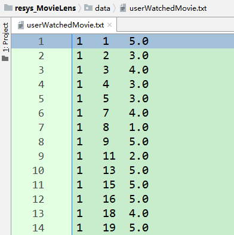
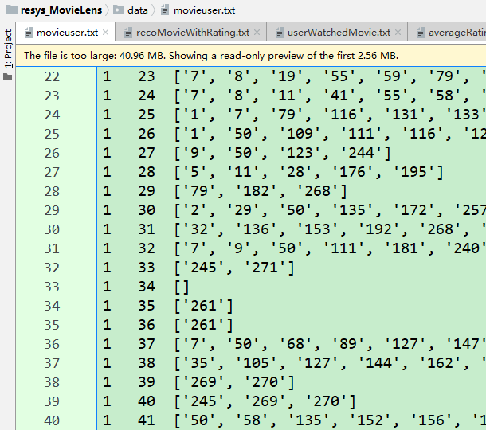
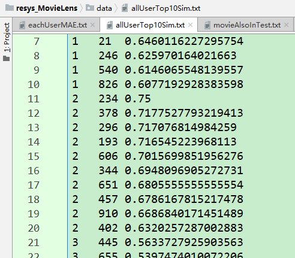
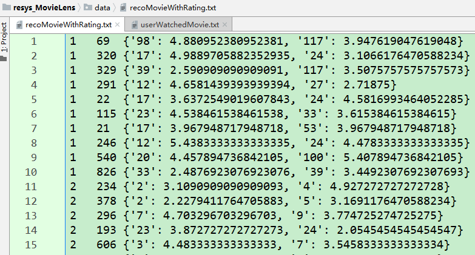
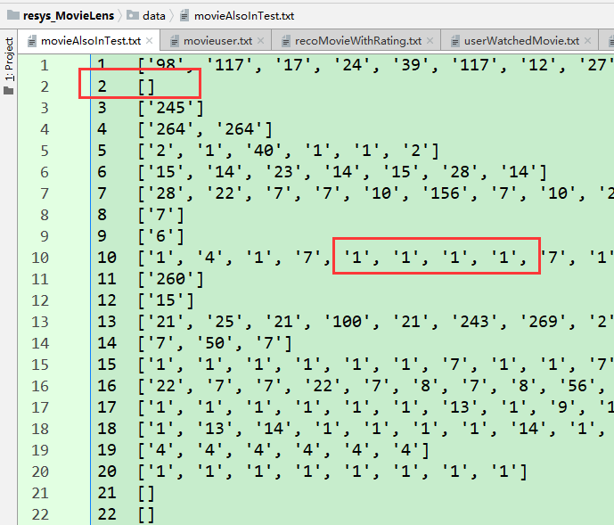
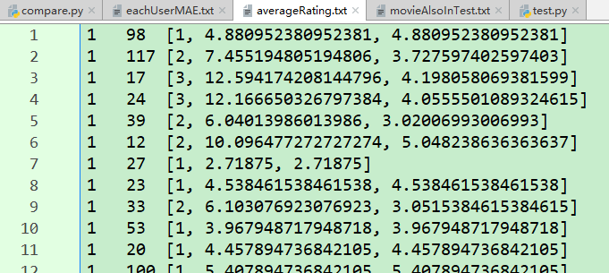
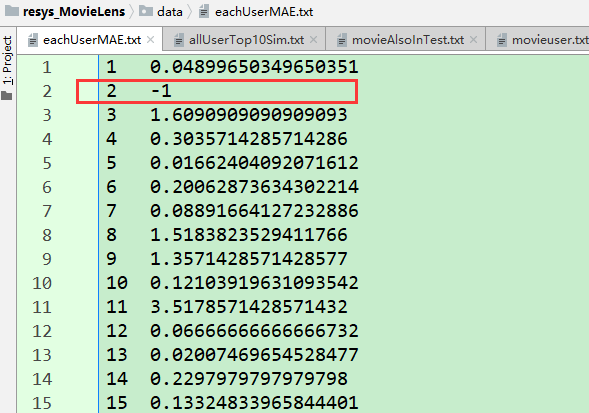
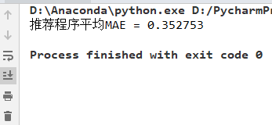
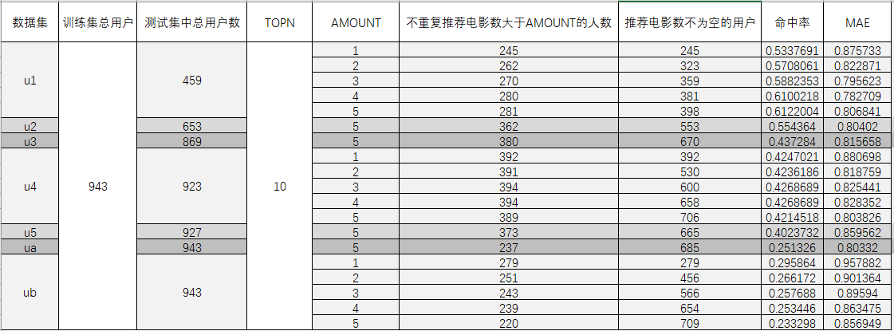
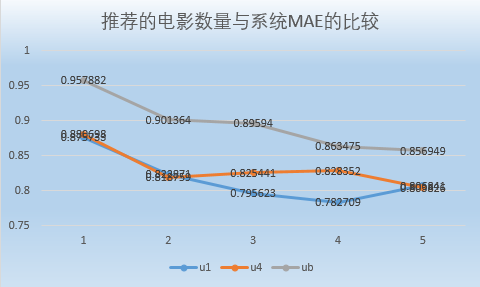

# 推荐系统课程作业  
本次课程作业在small-movielens数据集的基础上，对用户、电影、评分数据进行了处理，然后根据Pearson相关系数计算出用户与其他用户之间的相似度，根据相似度进行推荐和预测评分，最后再根据数据集中的测试数据，计算该推荐系统的MAE，预测命中率等。
## **1. 变量说明**  
**`users`** :保存所有用户，不重复`list`类型  
存储结构：`[user1, user2,...]`  
**`userWatchedMovie`** :保存所有用户看过的所有电影，字典嵌套字典类型  
存储结构：`{user1:{movie1:rating1, movie2:rating2, ...}, user2:{...},...}`  
**`movieUser`** :保存用户与用户之间共同看过的电影，字典嵌套字典嵌套`list`  
存储结构：`{user1:{user2:[movie1,...],user3:[...],...},user2:{user3:[...],...},...}`  
**`userSimilarity`** :保存用户与用户之间的相似度（**皮尔逊相似度**）  
存储结构：`{user1:{user2:sim, user3:sim,...}, user2:{user3:sim, ...}, ...}`  
**`allUserTopNSim`** :保存每个用户都取前`n=10`个最相似的用户，以及相似度  
存储结构：`{user1:{user01:sim,user02:sim,...},user2:{user01:sim,...},...}`  
**`recommendedMovies`** :从最相似的用户中推荐，每个相似用户推荐两部，同时计算出预测值并保存在这个变量里  
存储结构：`{user1:{user01:{movie01:predictionRating,...},user02:[...],...},user2:{user01:[...],...},...}`  
**`usersTest`** :测试集文件中的所有用户  
存储结构：同`users`  
**`userWatchedMovieTest`** :测试集文件中所有用户看过的所有电影  
存储结构：同`userWatchedMovie`  
**`movieAlsoInTest`** :保存推荐的电影正好也在用户测试数据中看过的那一些电影，以便后面进行MAE计算  
存储结构：`{user1:[movie1,movie2,...],...}`  
**`averageRating`** :保存每个用户对被推荐的电影的预测平均分  
存储结构：`{user1:{movie01:[count,sumPreRating,averageRating],...},...}`  
**`eachUserMAE`** :保存对每个用户而言计算出的`MAE`  
存储结构：`{user1:MAE,user2:MAE,...}`  
## **2. 程序介绍**  
+ 首先对数据进行处理，我们可以看到原始数据文件`u1.base`中的数据如下图所示  
  
数据是由`(userId, movieId, rating, timestamp)`四个部分组成，我们这里使用的是前三个数据属性  
用变量`users`保存所有的用户`ID`,`userWatchedMovie`保存所有的用户看过的所有的电影  
  
然后是对测试数据文件的读取，同上面做类似的处理  
+ 计算用户与用户之间共同看过的电影  
  
+ 计算用户与用户之间的相似度  
在这个部分我们利用`Pearson`相关系数计算出两两用户之间的相似度  

            avgUserA = 0
            avgUserB = 0
            numerate = 0
            denominatorA = 0
            denominatorB = 0
            count = len(movieUser[a][b])
            factor = 0
            if count > 20:
                factor = 1.0
            else:
                if count < 0:
                    factor = 0
                else:
                    factor = (-0.0025 * count * count) + (0.1 * count)
            for movie in movieUser[a][b]:
                avgUserA += float(userWatchedMovie[a][movie])
                avgUserB += float(userWatchedMovie[b][movie])
            avgUserA = float(avgUserA / count)
            avgUserB = float(avgUserB / count)
            for m in movieUser[a][b]:
                tempA = float(userWatchedMovie[a][m]) - avgUserA
                tempB = float(userWatchedMovie[b][m]) - avgUserB
                numerate += tempA * tempB
                denominatorA += pow(tempA, 2) * 1.0
                denominatorB += pow(tempB, 2) * 1.0
            if denominatorA != 0 and denominatorB != 0:
                userSimilarity[a][b] = factor * (numerate / (sqrt(denominatorA * denominatorB)))
            else:
                userSimilarity[a][b] = 0

+ 每个用户都取前`n`个最相似的用户，以便后续进行推荐，这里`n=10`  

        for compareUserId in users:
            if currentUserId == compareUserId:
                break
            else:
                singleUserSim[compareUserId] = userSimilarity[compareUserId][currentUserId]
        if int(currentUserId) != len(users):
            singleUserSim.update(userSimilarity[currentUserId])
        singleSortedSim = sorted(singleUserSim.items(), key=lambda item: item[1], reverse=True)
        singleTopN = singleSortedSim[:n]
        for single in singleTopN:
            allUserTopNSim[currentUserId][single[0]] = single[1]

      
+ 从最相似的用户中推荐，每个相似用户推荐两部，那么每个用户就能得到推荐的`20`部电影  

		if movie not in userWatchedMovie[oneUser].keys():
			if int(oneUser) < int(simUser):
				length = len(movieUser[oneUser][simUser])
				sumOne = 0.0
				sumSim = 0.0
				for i in movieUser[oneUser][simUser]:
					sumOne += userWatchedMovie[oneUser].get(i)
					sumSim += userWatchedMovie[simUser].get(i)
				sumSim += userWatchedMovie[simUser].get(movie)
				avgOneUser = sumOne / length
				avgSimUser = sumSim / (length + 1)
				predictionRating = avgOneUser + (userWatchedMovie[simUser][movie] - avgSimUser)
				recommendedMovies[oneUser][simUser][movie] = predictionRating
				number += 1

      
+ 从推荐的电影和测试集中找到一起看过的电影  

        movieAlsoInTest = {}
        for oneUser in usersTest:
			movieAlsoInTest.setdefault(oneUser, [])
			for simUser in recommendedWithRating[oneUser].keys():
				for movie in recommendedWithRating[oneUser][simUser].keys():
					if movie in userWatchedMovieTest[oneUser].keys():
						movieAlsoInTest[oneUser].append(movie)
					else:
						continue

      
+ 计算每个用户被推荐的每部电影的次数和平均分  

		averageRating = {}
		for oneUser in usersTest:
			averageRating.setdefault(oneUser, {})
			for simUser in recommendedWithRating[oneUser].keys():
				for movie in recommendedWithRating[oneUser][simUser].keys():
					averageRating[oneUser].setdefault(movie, [0, 0.0, 0.0])
					averageRating[oneUser][movie][0] += 1
					averageRating[oneUser][movie][1] += recommendedWithRating[oneUser][simUser].get(movie)
			for each in averageRating[oneUser].keys():
				verageRating[oneUser][each][2] = averageRating[oneUser][each][1] / averageRating[oneUser][each][0]

      
+ 计算`MAE`  

		eachUserMAE = {}
		for oneUser in averageRating.keys():
			count = 0
			sumD = 0.0
			eachUserMAE.setdefault(oneUser, 0.0)
			for movie in movieAlsoInTest[oneUser]:
				count += 1
				sumD = abs(averageRating[oneUser][movie][2] - userWatchedMovieTest[oneUser].get(movie))
			if count == 0:
				eachUserMAE[oneUser] = -1
			else:
				eachUserMAE[oneUser] = sumD / count

      

		recommendedMAE = 0.0
		countMAE = 0
		for oneUser in eachUserMAE.keys():
			if eachUserMAE[oneUser] != -1:
				countMAE += 1
				recommendedMAE += eachUserMAE[oneUser]
		recommendedMAE = recommendedMAE / countMAE

      
    另外可以引入准确度或者说命中率  
+ 结果分析  
笔者对`u1-u5`以及`ua-ub`数据集中的数据分别进行了实验测试，并统计出如下结果  
  
从表格中科院看出，推荐的电影的不同数量会对系统的`MAE`造成不同程度的影响，可以看到基本上在`TOPN=10`，`AMOUNT=5`的情况下
系统的MAE较之其他情况是比较好的。我们将该种情况下的相关数据抽离出来，以便更加直观的看到结果，如下表以及下图所示。  

    AMOUNT|u1|u4|ub
    :--:|:--:|:--:|:--:
    1|0.875733|0.880698|0.957882
    2|0.822871|0.818759|0.901364
    3|0.795623|0.825441|0.89594
    4|0.782709|0.828352|0.863475
    5|0.806841|0.803826|0.856949

      

@Time : 2019/3/30  
@Author : [Freator Tang](https://github.com/freator)  
@Email : bingcongtang@gmail.com
