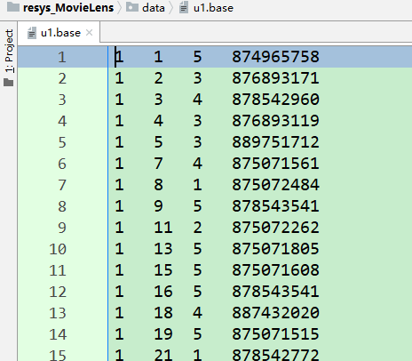

# 推荐系统课程作业  
本次课程作业在small-movielens数据集的基础上，对用户（待续）  
**1. 变量说明**  
users :保存所有用户，不重复list类型  
userWatchedMovie :保存所有用户看过的所有电影，字典嵌套字典类型  
movieUser :保存用户与用户之间共同看过的电影，字典嵌套字典嵌套list  
userSimilarity :保存用户与用户之间的相似度（皮尔逊相似度）  
allUserTopNSim :保存每个用户都取前n(n=10)个最相似的用户，以及相似度  
recommendedMovies :从最相似的用户中推荐，每个相似用户推荐两部，同时计算出预测值并保存在这个变量里  
usersTest :测试集文件中的所有用户，同users  
userWatchedMovieTest :测试集文件中所有用户看过的所有电影，同userWatchedMovie  
movieAlsoInTest :保存推荐的电影正好也在用户测试数据中看过的那一些电影，以便后面进行MAE计算  
averageRating :保存每个用户对被推荐的电影的预测平均分  
eachUserMAE :保存对每个用户而言计算出的MAE  
**2. 程序介绍**  
<1>首先对数据进行处理，我们可以看到原始数据文件`u1.base`中的数据如下图所示  
  
数据是由(userId, movieId, rating, timestamp)四个部分组成，我们这里使用的是前3个数据属性，即userId, movieId和rating  
用变量users保存所有的userId,userWatchedMovie保存所有的用户看过的所有的电影  
（这里贴上图片users和userW的部分内容）  

然后是对测试数据文件的读取，同上面做类似的处理  
<2>计算用户与用户之间共同看过的电影  
  
<3>计算用户与用户之间的相似度  
在这个部分我们利用Pearson相关系数计算出两两用户之间的相似度  
（贴上pearson那一部分的代码，并且说明factor的作用）  

            avgUserA = 0
            avgUserB = 0
            numerate = 0
            denominatorA = 0
            denominatorB = 0
            count = len(movieUser[a][b])
            factor = 0
            if count > 20:
                factor = 1.0
            else:
                if count < 0:
                    factor = 0
                else:
                    factor = (-0.0025 * count * count) + (0.1 * count)
            for movie in movieUser[a][b]:
                avgUserA += float(userWatchedMovie[a][movie])
                avgUserB += float(userWatchedMovie[b][movie])
            avgUserA = float(avgUserA / count)
            avgUserB = float(avgUserB / count)
            for m in movieUser[a][b]:
                tempA = float(userWatchedMovie[a][m]) - avgUserA
                tempB = float(userWatchedMovie[b][m]) - avgUserB
                numerate += tempA * tempB
                denominatorA += pow(tempA, 2) * 1.0
                denominatorB += pow(tempB, 2) * 1.0
            if denominatorA != 0 and denominatorB != 0:
                userSimilarity[a][b] = factor * (numerate / (sqrt(denominatorA * denominatorB)))
            else:
                userSimilarity[a][b] = 0

<4>每个用户都取前n个最相似的用户，以便后续进行推荐，这里n=10  
（贴上代码块，并且贴上图片，说明此处的排序思想）  

        for compareUserId in users:
            if currentUserId == compareUserId:
                break
            else:
                singleUserSim[compareUserId] = userSimilarity[compareUserId][currentUserId]
        if int(currentUserId) != len(users):
            singleUserSim.update(userSimilarity[currentUserId])
        singleSortedSim = sorted(singleUserSim.items(), key=lambda item: item[1], reverse=True)
        singleTopN = singleSortedSim[:n]
        for single in singleTopN:
            allUserTopNSim[currentUserId][single[0]] = single[1]

  
<5>从最相似的用户中推荐，每个相似用户推荐两部，那么每个用户就能得到推荐的20部电影  
（贴上代码块，分开贴，说明这个过程中还计算出来了预测评分）  

    if movie not in userWatchedMovie[oneUser].keys():
        if int(oneUser) < int(simUser):
            length = len(movieUser[oneUser][simUser])
            sumOne = 0.0
            sumSim = 0.0
            for i in movieUser[oneUser][simUser]:
                sumOne += userWatchedMovie[oneUser].get(i)
                sumSim += userWatchedMovie[simUser].get(i)
            sumSim += userWatchedMovie[simUser].get(movie)
            avgOneUser = sumOne / length
            avgSimUser = sumSim / (length + 1)
            predictionRating = avgOneUser + (userWatchedMovie[simUser][movie] - avgSimUser)
            recommendedMovies[oneUser][simUser][movie] = predictionRating
            number += 1

  
<6>从推荐的电影和测试集中找到一起看过的电影  
（贴出代码块，并附上结果截图）  

    movieAlsoInTest = {}
    for oneUser in usersTest:
        movieAlsoInTest.setdefault(oneUser, [])
        for simUser in recommendedWithRating[oneUser].keys():
            for movie in recommendedWithRating[oneUser][simUser].keys():
                if movie in userWatchedMovieTest[oneUser].keys():
                    movieAlsoInTest[oneUser].append(movie)
                else:
                    continue

  
<7>计算每个用户被推荐的每部电影的次数和平均分  
（贴上代码块讲解就行，可以说一下为啥要这样计算平均分，还有存储的结构，最好放上图片）  

    averageRating = {}
    for oneUser in usersTest:
        averageRating.setdefault(oneUser, {})
        for simUser in recommendedWithRating[oneUser].keys():
            for movie in recommendedWithRating[oneUser][simUser].keys():
                averageRating[oneUser].setdefault(movie, [0, 0.0, 0.0])
                averageRating[oneUser][movie][0] += 1
                averageRating[oneUser][movie][1] += recommendedWithRating[oneUser][simUser].get(movie)
        for each in averageRating[oneUser].keys():
            averageRating[oneUser][each][2] = averageRating[oneUser][each][1] / averageRating[oneUser][each][0]

  
<8>计算MAE（总体的和每个用户的  
（贴上两部分的代码块，并截图）  

    eachUserMAE = {}
    for oneUser in averageRating.keys():
        count = 0
        sumD = 0.0
        eachUserMAE.setdefault(oneUser, 0.0)
        for movie in movieAlsoInTest[oneUser]:
            count += 1
            sumD = abs(averageRating[oneUser][movie][2] - userWatchedMovieTest[oneUser].get(movie))
        if count == 0:
            eachUserMAE[oneUser] = -1
        else:
            eachUserMAE[oneUser] = sumD / count

  

    recommendedMAE = 0.0
    countMAE = 0
    for oneUser in eachUserMAE.keys():
        if eachUserMAE[oneUser] != -1:
            countMAE += 1
            recommendedMAE += eachUserMAE[oneUser]
    recommendedMAE = recommendedMAE / countMAE

  
另外可以引入准确度或者说命中率  

@Author : Freator  
@Email : bingcongtang@gmail.com
